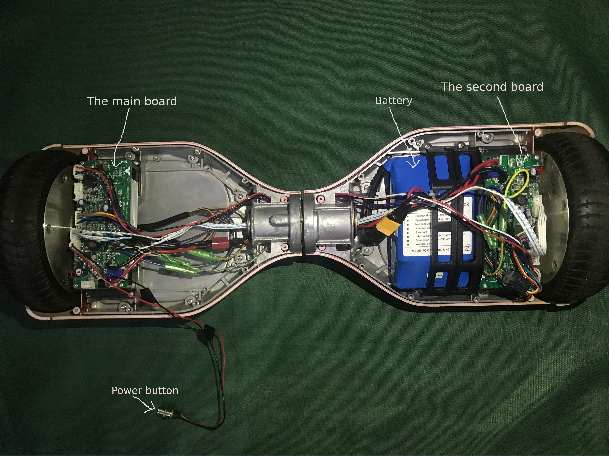
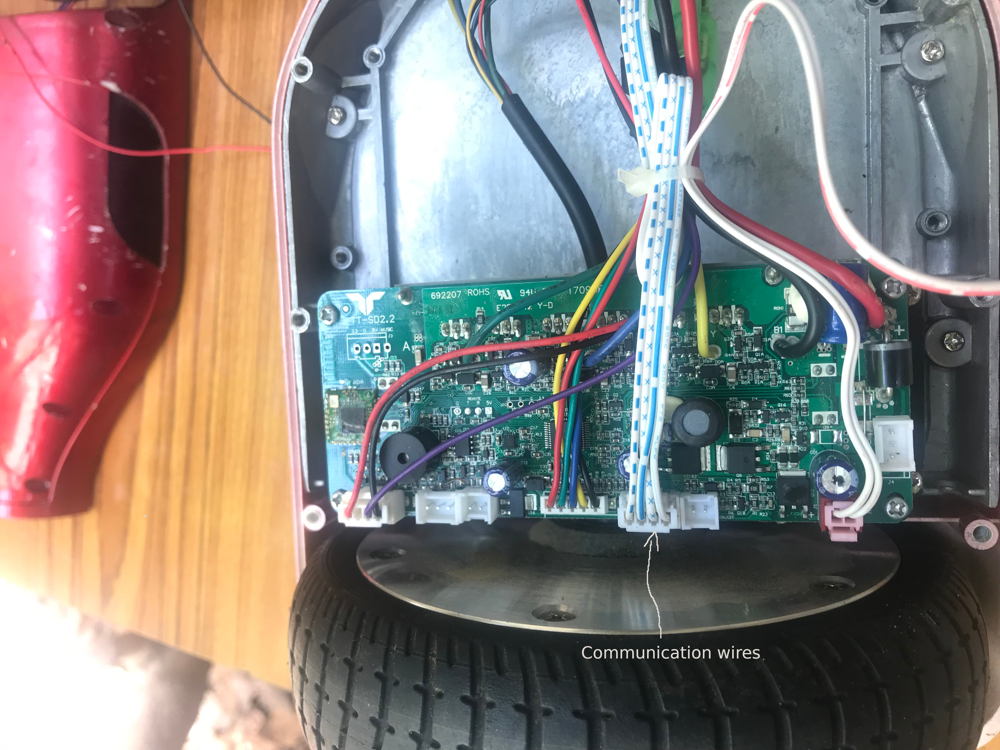
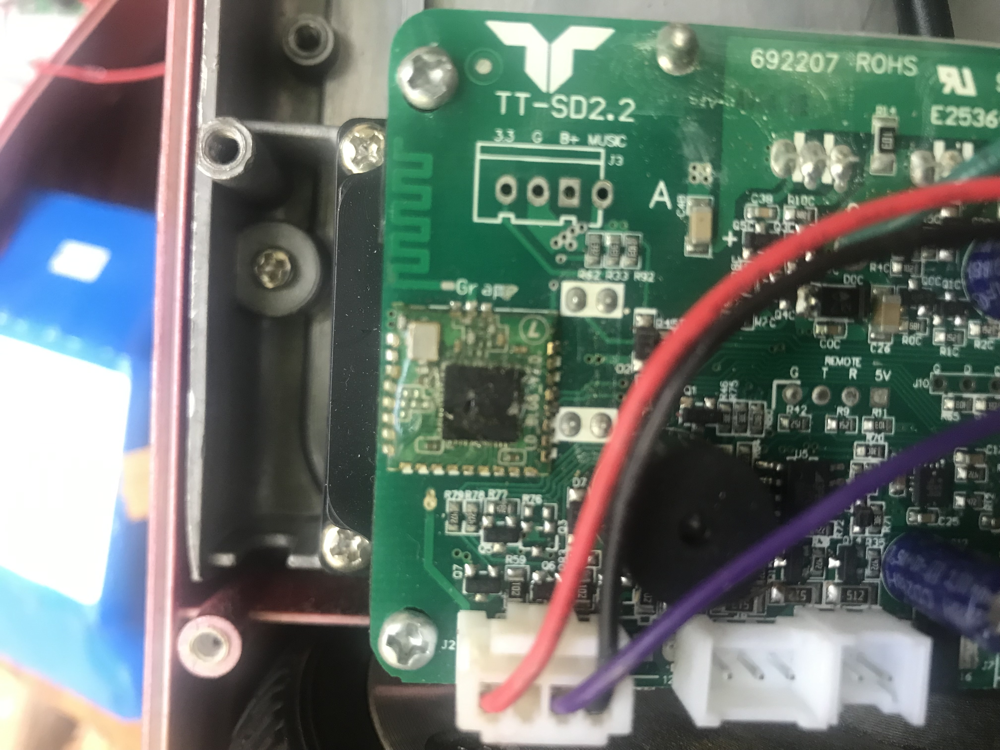
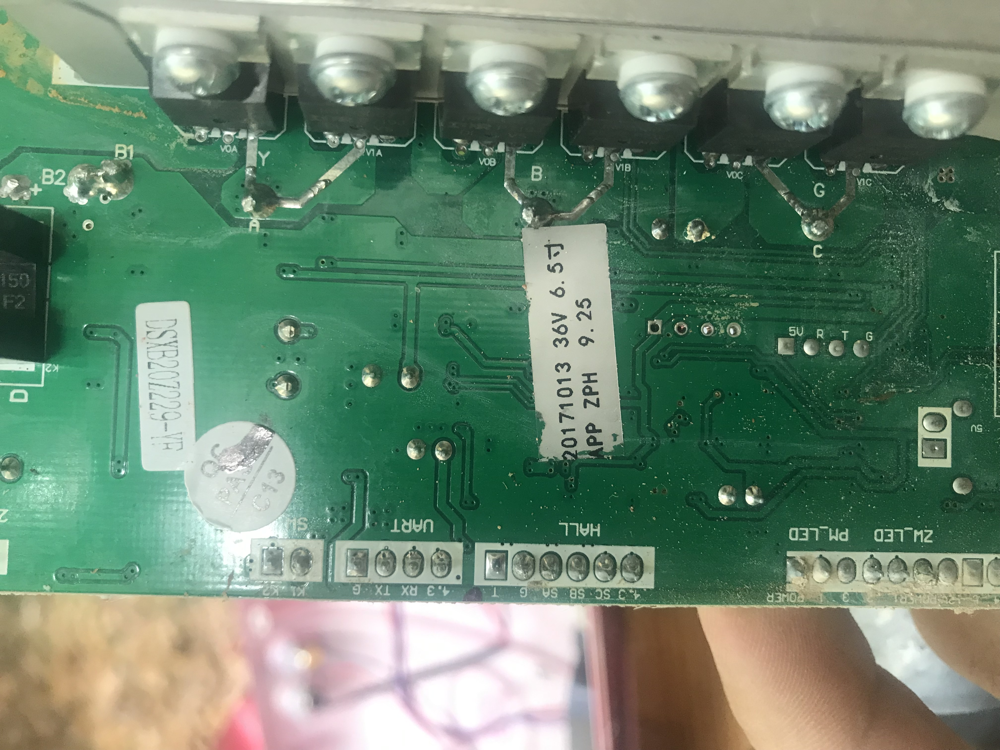
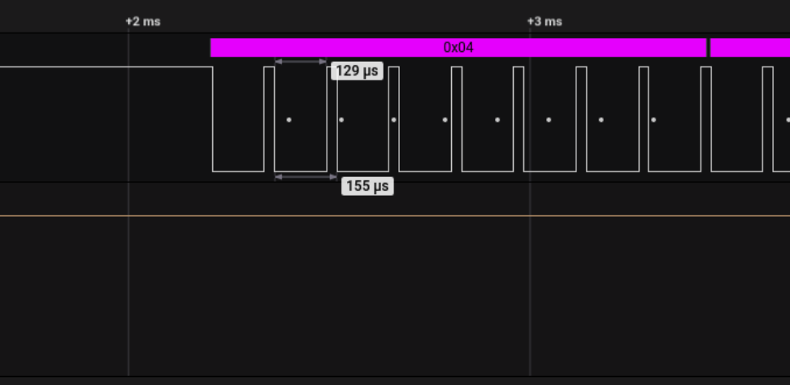
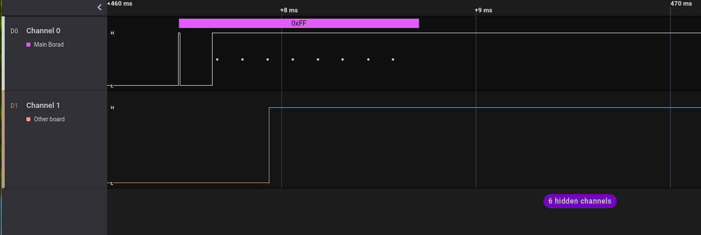
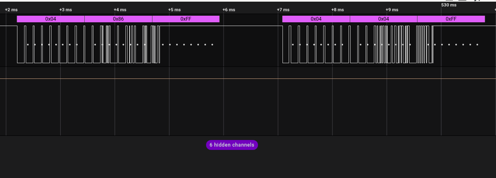

# Controlling the Hoverboard using NVIDIA Jetson Nano
The barin of the Akerfabot is an NVIDIA Jetson Nano board. The brain will process the video feed coming from the camera, identify trash and move the robot twords it then collecting it using a robotic arm.
In this part we will see how to control the hoverboard in order to move the robot.

# The hoverboard main components:
Unlike the hoverbard I found on the internet (like this one [hoverboard-firmware-hack-FOC
](https://github.com/EFeru/hoverboard-firmware-hack-FOC)), the one I have has jsut two electronic boards. 

The main components of the hoverboard are: the battery, the two electronic card (one of them is the main board), the motors and their drivers.

## Electronic board:
The two electronic board are almost identical. However the main board contains a communication module (RF or bluetooth), but when I checked bleutooth device list in my phone nothing showed up. 

.

When flippng the board, the labels indicate that the protocol used to communicate between the two boards is UART.
. This means, that in order to communicate with the hoverboard we need to know two things: the baud rate and the data frames to send to the board.
## Analysing the signal:
To determine the baud rate used by the board to communicate over UART, I used a logic analyser to read the data and figure out the information I needed.

The  lenght of a puls is 129 us, which mean that the baud rate is: 7752 bps
`(1/129)*10^6=7751.937` 
For the packet we get a pathern that repeats during the communication process. when powering the hoverboard, the communication starts with the frame 0xFF (looks weird to me). Then, after severla micro-seconds, we recieve a hex number between 0x04 and 0xFF.
 

## Test:
During the tests, I uploaded a simple Arduino code to the pro-mini in order to recreate the communication frames. When turning the hoverboard on and connecting the ardiono to it, it starts to move backward, then after a few second, the hoverboard stops and shut off. I repeated the test manytimes and got the same results. Meaning that, there is a communication problem between the Arduino and the hoverboard.

I also tried to test each board alone, but when disconnecting the board from each other, the motor that is attached to the main board starts rotating without stoping, and the other motor does not rotate. I also checked that the signal voltage provided by the Arduino is the same as the one in the board. But still the hoverboard keeps turning off after few seconds when connected to Arduino.
